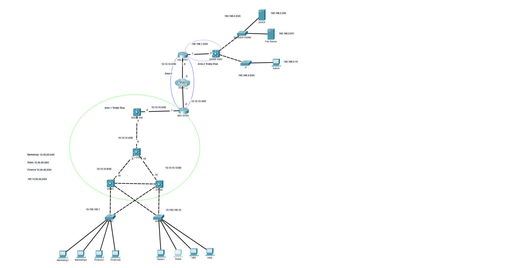
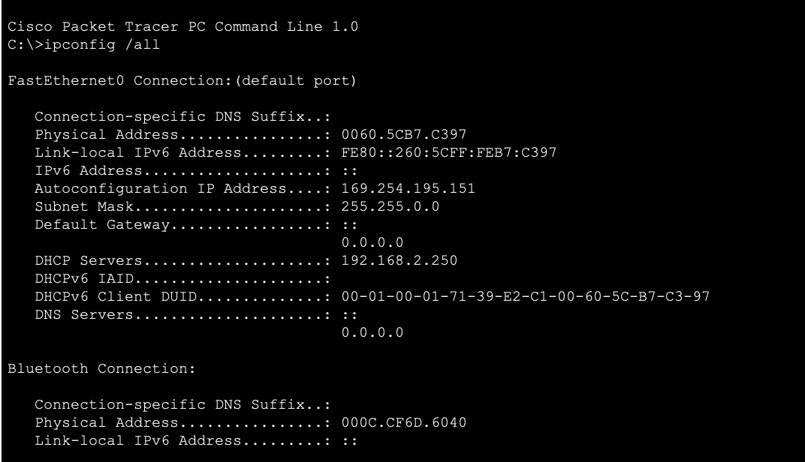

# Troubleshooting Lab: DHCP Failure Caused by an Incorrect Static Route

**Scenario:** Sales2 could not reach the Internet host `13.13.13.1`.  
**Root cause:** an incorrect `/30` static route on `BR1-RTR1` overrode the correct OSPF `/24` path because of **Longest Prefix Match**.  
**Result:** removing the bad static route restored DHCP and end-to-end connectivity.

## Lab Summary

| Item | Details |
|---|---|
| Platform | Cisco Packet Tracer |
| Affected VLAN | VLAN 30 – Sales |
| Sales subnet | `10.30.30.0/24` |
| Default gateway | `10.30.30.1` |
| DHCP server | `192.168.2.250` |
| Routing | OSPF + Static Routing |
| Redundancy | HSRP |
| Main symptom | Sales hosts received APIPA addresses |
| Root cause | Incorrect static route `10.30.30.0/30` |
| Fix | Remove the incorrect static route |

## Topology





## Problem Statement

**The reported issue was:** The user at **Sales2** is unable to reach an Internet webpage with IP `13.13.13.1`.

The first step was to verify the endpoint configuration rather than immediately assuming an Internet-routing problem.

## Troubleshooting Walkthrough

### 1. Check the affected endpoint

On **Sales2**:

```text
ipconfig /all
```

The PC had:



A renewal was attempted:


### Finding

`169.254.0.0/16` is an APIPA range.

This showed that the host had failed to obtain an IPv4 lease through DHCP.

**At this point, the real problem was no longer “Internet access”.  
The first actual failure was DHCP.**

## 2. Check whether the issue affects only Sales2

The same commands were run on **Sales1**.

Sales1 also had:

- an APIPA address;
- no valid default gateway;
- `DHCP request failed`.

### Finding

The issue affected multiple hosts in the same VLAN.

That made a single-PC problem unlikely and moved the investigation toward the network infrastructure.

## 3. Verify the Sales access ports

On **ASW2**:

```cisco
show interfaces status
```

Relevant output:

```text
Fa0/2   connected   30
Fa0/3   connected   30
Fa0/5   connected   trunk
```

Then:

```cisco
show vlan brief
```

Relevant output:

```text
30   VLAN0030   active   Fa0/2, Fa0/3
```

And the interface configuration showed:

```cisco
interface FastEthernet0/2
 switchport access vlan 30
 switchport mode access
 spanning-tree portfast

interface FastEthernet0/3
 switchport access vlan 30
 switchport mode access
 spanning-tree portfast
```

### Finding

Both Sales ports were:

- physically up;
- configured as access ports;
- assigned to VLAN 30;
- not administratively shut down.

---

## 4. Check port security

```cisco
show port-security interface fa0/2
show port-security interface fa0/3
```

Result:

```text
Port Security : Disabled
```

### Finding

Port security was not blocking the Sales hosts.

---

## 5. Verify VLAN 30 across the trunk

On **ASW2**:

```cisco
show interfaces trunk
```

Relevant output:

```text
Vlans allowed on trunk:
1-1005

Vlans allowed and active in management domain:
1,10,30,50,100

Vlans in spanning tree forwarding state and not pruned:
10,30,50,100
```

### Finding

VLAN 30 was:

- allowed on the trunk;
- active;
- forwarding;
- not pruned.

The same check was performed on **DSW2**, where VLAN 30 was also present and forwarding.

---

## 6. Verify the VLAN 30 Layer 3 gateway

### DSW1

```cisco
interface Vlan30
 ip address 10.30.30.2 255.255.255.0
 ip helper-address 192.168.2.250
 ip ospf 1 area 1
 standby 30 ip 10.30.30.1
```

### DSW2

```cisco
interface Vlan30
 ip address 10.30.30.3 255.255.255.0
 ip helper-address 192.168.2.250
 ip ospf 1 area 1
 standby 30 ip 10.30.30.1
 standby 30 priority 200
 standby 30 preempt
```

### Finding

The Sales VLAN had:

- `10.30.30.2` on DSW1;
- `10.30.30.3` on DSW2;
- HSRP virtual gateway `10.30.30.1`;
- DHCP relay configured on both switches.

So the expected client gateway was:

```text
10.30.30.1
```

---

## 7. Verify DHCP relay

Both distribution switches contained:

```cisco
ip helper-address 192.168.2.250
```

The DHCP server was in another subnet:

```text
DHCP Server: 192.168.2.250
Sales VLAN:  10.30.30.0/24
```

Because DHCP Discover is broadcast traffic and routers do not forward Layer 3 broadcasts by default, the `ip helper-address` was required.

### Finding

The relay configuration was present and pointed to the correct DHCP server.

## 8. Verify reachability to the DHCP server

From **DSW1**:

```text
ping 192.168.2.250
```

Result:

```text
Success rate is 100 percent (5/5)
```

From **DSW2**:

```text
ping 192.168.2.250
```

Result:

```text
Success rate is 100 percent (5/5)
```

### Finding

Both DHCP relay devices could reach the server.

## 9. Confirm the DHCP server works for other VLANs

On **HR1**:

```text
IPv4 Address:    10.50.50.12
Subnet Mask:     255.255.255.0
Default Gateway: 10.50.50.1
DHCP Server:     192.168.2.250
DNS Server:      8.8.8.8
```

### Finding

The same DHCP server successfully served another VLAN.

This ruled out a complete DHCP server failure.

## 10. Test the return path from the DHCP server

From the DHCP server:

```text
ping 10.30.30.2
```

Result:

```text
Request timed out.
```

The server could still reach its own default gateway:

```text
ping 192.168.2.1
```

which succeeded.

The DHCP server configuration was:

```text
IPv4 Address:    192.168.2.250
Subnet Mask:     255.255.255.0
Default Gateway: 192.168.2.1
```

### Finding

The DHCP server had local connectivity, but traffic could not return to the Sales VLAN.

This shifted the investigation from DHCP itself to **routing**.

## 11. Trace the failed route

From **EDGE-SW2**:

```cisco
traceroute 10.30.30.2
```

Output:

```text
1   192.168.1.1
2   172.16.1.2
3   * * *
```

The second hop, `172.16.1.2`, was identified as **BR1-RTR1**.

### Finding

Traffic failed after reaching BR1-RTR1.

This made BR1-RTR1 the next device to inspect.

## 12. Inspect the routing table on BR1-RTR1

```cisco
show ip route
```

Two routes were present:

```text
O  10.30.30.0/24 [110/4] via 10.10.10.2
S  10.30.30.0/30 [1/0] via 12.12.12.1
```

The running configuration contained:

```cisco
ip route 10.30.30.0 255.255.255.252 12.12.12.1
```

This was the root cause.

# Root Cause

The incorrect static route was:

```cisco
ip route 10.30.30.0 255.255.255.252 12.12.12.1
```

`255.255.255.252` is `/30`.

Therefore the route covered:

```text
10.30.30.0/30
```

which contains:

| Address | Role |
|---|---|
| `10.30.30.0` | Network |
| `10.30.30.1` | HSRP virtual gateway |
| `10.30.30.2` | DSW1 VLAN 30 SVI |
| `10.30.30.3` | DSW2 VLAN 30 SVI |

At the same time, OSPF had the correct route:

```text
10.30.30.0/24 via 10.10.10.2
```

## Why the Static Route Won

This lab demonstrates an important routing rule:

> **Longest Prefix Match is evaluated before Administrative Distance.**

For destination `10.30.30.2`, both routes matched:

```text
10.30.30.0/24   OSPF
10.30.30.0/30   Static
```

But:

```text
/30 > /24
```

So the router selected the `/30` route because it was more specific.

The packet was therefore sent toward:

```text
12.12.12.1
```

instead of following the correct OSPF path.

Administrative Distance did **not** decide between these two routes because their prefix lengths were different.

# Resolution

The incorrect static route was removed:

```cisco
configure terminal
no ip route 10.30.30.0 255.255.255.252 12.12.12.1
end
```

The router could then use the correct OSPF route:

```text
O 10.30.30.0/24 via 10.10.10.2
```

# Validation

On the Sales workstation:

```text
ipconfig /renew
```

The PC successfully obtained an address from:

```text
10.30.30.0/24
```

The original test was then repeated:

```text
ping 13.13.13.1
```

Connectivity succeeded.


# Commands Used

### Endpoint

```text
ipconfig /all
ipconfig /renew
ping <destination>
```

### Access Switch

```cisco
show interfaces status
show vlan brief
show interfaces trunk
show interfaces fa0/2
show interfaces fa0/3
show interfaces fa0/2 switchport
show interfaces fa0/3 switchport
show mac address-table
show port-security interface fa0/2
show port-security interface fa0/3
show running-config
```

### Distribution Switches

```cisco
show ip interface brief
show interfaces trunk
show running-config
show ip arp
show ip dhcp snooping
ping 192.168.2.250
```

### Routing Devices

```cisco
show ip route
show ip route 10.30.30.0
ping 10.30.30.2
traceroute 10.30.30.2
show running-config
```

## What This Lab Demonstrates

This lab demonstrates practical troubleshooting across:

- DHCP and APIPA
- VLAN
- access ports
- 802.1Q trunks
- STP forwarding
- SVIs
- HSRP
- DHCP relay
- OSPF
- static routing
- routing-table analysis
- traceroute
- Longest Prefix Match
- Administrative Distance
- end-to-end fault isolation

## Key Takeaway

The most important lesson from this lab is:

> A route with a more specific prefix wins even if another route comes from a protocol with a different Administrative Distance.

In this case:

```text
10.30.30.0/30
```

overrode:

```text
10.30.30.0/24
```

because `/30` is the longer and therefore more specific prefix.
